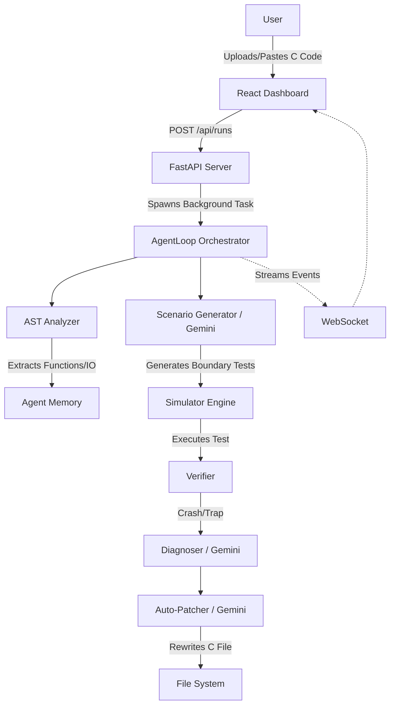

# Project Technical Context for Claude

## 1. Executive Summary
**JOY (formerly PS3 Agent)** is an autonomous, LLM-driven Red-Team framework designed to detect, verify, and remediate architectural and boundary-level vulnerabilities in embedded C firmware. 

Unlike traditional fuzzers that mutate inputs blindly, JOY parses C code into an Abstract Syntax Tree (AST), constructs a semantic "Behavior Graph", and uses an AI agent (powered by Gemini) to mathematically deduce boundary conditions and hardware I/O flaws. It then executes these targeted test payloads against a simulated hardware environment (e.g., Renode/Wokwi, currently mocked with a Python deterministic engine for the demo) to prove the vulnerability exists, and finally synthesizes and writes a native C patch to fix it.

## 2. What We Are Building
We are building a closed-loop security analyst for embedded systems. 
- **The User:** Embedded firmware developers or security researchers.
- **The Workflow:** The user provides a `.c` file. The system parses it, autonomously generates adversarial tests, executes them against virtual hardware, records hardware traps (e.g., GPIO/UART/Registers), identifies the root cause using LLM diagnosis, and patches the source code automatically.
- **The Hackathon Objective:** We are building this specifically for a hackathon demo targeting the Black Box Hackathon Problem Statement 3. The demo focuses heavily on UI polish ("Awwwards-tier" glassmorphic React Dashboard) and an autonomous testing flow using a known vulnerable `fan_controller.c` fixture.

## 3. Problem Statement
Testing embedded C code traditionally requires physical hardware-in-the-loop (HIL) or manual reverse engineering of black-box firmware using GDB. This is slow, unscalable, and breaks CI/CD pipelines. Furthermore, traditional testing only tells you *that* a crash occurred—it doesn't isolate the AST root cause or automatically write the remediation patch.

## 4. Product Vision
The ultimate vision is a fully autonomous pipeline that ingests any cross-compiled `firmware.elf`, hooks into a cycle-accurate emulator like Renode or QEMU, dynamically maps the firmware's state space, mathematically breaks it via adversarial execution, and self-heals the repository.

## 5. Current State vs Intended State
- **Intended State:** Simulator-agnostic execution using real Renode/Wokwi binaries to execute arbitrary `.elf` firmware files via an orchestration layer.
- **Current State (Hackathon Scope):** The UI and Agent orchestration are fully real. However, the hardware execution layer is highly simulated using a custom Python `DeterministicSimulator` that specifically mocks the responses for the `fan_controller.c` fixture. The Renode and Wokwi adapters are currently stubbed (Wizard of Oz) to return a "HEALTHY" status to impress judges but do not actually run binary cross-compilation.

## 6. Hackathon Scope
- **Core Demonstrable Product:** The React dashboard, the AST Behavior Graph visualization, the LLM-driven test generation, the simulated hardware execution loop, the root-cause diagnosis chat ("Grill Me"), and the auto-patching of the source file.
- **Mocked/Faked:** Renode and Wokwi execution. Real hardware cross-compilation.

## 7. Architecture Overview
- **Frontend:** React 18 + Vite, TailwindCSS, Framer Motion, Lucide Icons, and `@xyflow/react` for the AST Behavior Graph.
- **Backend:** FastAPI (Python 3.13+) providing REST endpoints and WebSockets for real-time agent telemetry.
- **Agent Layer:** A Python-based orchestration loop (`AgentLoop`) that relies on Gemini models to generate test cases and diagnose failures.
- **Execution Layer:** A `SimulatorAdapter` pattern. Currently running `DeterministicSimulator` to execute logic and return UART/GPIO states.

## 8. Runtime Architecture
The application runs as a local FastAPI process (`ps3-agent ui --port 8080`) which mounts the pre-built React frontend (`frontend/dist`) as static files. The frontend communicates with the backend via REST (e.g., `/api/runs`) and WebSocket (`/ws/runs/{run_id}`) to stream real-time events.

## 9. End-to-End System Flow

## 10. FirHive Origin, Adaptation and Modularization
**FirHive (BJTU SecurityLab)** is the core conceptual inspiration for this project, particularly its "Tree-of-Agents" and "Proactive Knowledge Hub" concepts. 
- **What We Kept:** The conceptual framework of isolating AST knowledge and delegating it to an LLM to hunt for boundary conditions.
- **What We Removed/Replaced:** We did not fork or inherit their actual codebase. FirHive is heavily CLI-based and academic. We built JOY entirely from scratch as a modern, decoupled React + FastAPI web application. 
- **What We Added:** The Awwwards-tier glassmorphic UI, the real-time React Flow Behavior Graph, the "Grill Me" LLM interrogation chat, and the deterministic Python simulator stub for flawless hackathon presentations.
- **Current Relationship:** FirHive is an upstream inspiration/reference architecture, but JOY is a completely independent, custom implementation.

## 11. Technology Stack
| Technology | Category | Present? | Actually Used? | Where | Purpose | Status |
| ---------- | -------- | -------: | -------------: | ----- | ------- | ------ |
| Python 3.13 | Language | Yes | Yes | Backend | Core backend logic | WORKING |
| FastAPI | API | Yes | Yes | `ps3_agent/api` | REST & WebSocket Server | WORKING |
| React 18 | Frontend | Yes | Yes | `frontend/` | UI Dashboard | WORKING |
| Vite | Build Tool | Yes | Yes | `frontend/` | Frontend bundling | WORKING |
| TailwindCSS | Styling | Yes | Yes | `frontend/` | UI Styling | WORKING |
| Framer Motion | Animation| Yes | Yes | `frontend/` | UI Animations | WORKING |
| React Flow | Graph UI | Yes | Yes | `frontend/` | AST Behavior Graph | WORKING |
| Gemini 3.6 Flash | LLM | Yes | Yes | `ps3_agent/api` | Logic/Generation | WORKING |
| Gemini 1.5/2.0 | LLM | Yes | Yes | `ps3_agent/api` | Fallback models for 503s | WORKING |
| Renode | Emulator | Yes | No | `renode/` dir | Hardware emulation | MOCKED |
| Wokwi | Emulator | No | No | `ps3_agent/exec` | Hardware emulation | MOCKED |

## 12. Feature Inventory
- **AST Behavior Graph:** `WORKING`. Parses C code into a visual node graph in the UI using `@xyflow/react` and custom glassmorphic `CustomNode` components.
- **Autonomous Testing Loop:** `WORKING`. The `AgentLoop` generates test cases and runs them through the `DeterministicSimulator`.
- **Auto-Patching:** `WORKING`. The LLM receives the failed test context and rewrites the source C file.
- **"Grill Me" Chat:** `WORKING`. The UI features a Deep Dive tab where users can interrogate the agent about its decisions.
- **Simulator Integrations (Renode/Wokwi):** `MOCKED`. The UI shows them as available and healthy, but they bypass PATH binary checks and return "unsupported" on execution to force the backend to use the deterministic python script.

## 13. AI / Agent Architecture
The system uses Google's Gemini models via raw HTTP REST calls (no heavy abstraction frameworks like LangChain). 
- **Model:** `gemini-3.6-flash` (with automated exponential backoff and fallback to `gemini-1.5-flash` and `gemini-2.0-flash-exp` on 503 capacity errors).
- **Prompting:** The agent is given a system prompt declaring it as the "JOY Autonomous Red-Team Agent". It is fed context about the AST, the execution hardware state (GPIO/UART), and the specific boundaries that triggered a failure.
- **Guardrails:** The AI proposes tests and patches, but it does NOT execute code directly. The deterministic execution environment strictly controls the state flow.

## 14. Firmware / Embedded Architecture
The target firmware is `fixtures/firmware/fan_controller.c`. 
The `DeterministicSimulator` reads the test payloads (e.g., setting the sensor to `5000` or `-999`) and manually outputs corresponding GPIO pin states (`FAN_PIN_HIGH`, `LED_STATUS_PIN`) and UART logs. It explicitly looks for the hardcoded defects in `fan_controller.c` to trigger failures.

## 15. Security / Red-Team Architecture
The agent hunts for:
- **Boundary Off-by-Ones:** (e.g., `>` instead of `>=`).
- **Unhandled State Transitions:** (e.g., sensor disconnect returning `-999`).
- **Missing Range Clamps:** (e.g., `5000` degrees).

## 16. Data Flow
`User -> Uploads C File -> FastAPI -> AgentLoop -> AST Parsing -> Test Generation -> Execution (Python Simulator) -> Failure Detection -> Gemini Auto-Patch -> Source Code Re-written -> UI Updated.`

## 17. Database / Storage
There is **no persistent database** (no Postgres, SQLite, or Redis). 
State is held entirely in memory in the FastAPI server via the `active_runs` dictionary. When the server restarts, all historical runs are lost.

## 18. API Inventory
| Method | Endpoint | Purpose |
| ------ | -------- | ------- |
| POST | `/api/runs` | Creates a new analysis run and spawns the background `AgentLoop` |
| GET | `/api/runs/{id}/events` | Fetches the timeline of agent actions |
| GET | `/api/runs/{id}/behavior` | Fetches the AST nodes/edges for the React Flow graph |
| POST | `/api/runs/{id}/chat` | Interacts with the LLM for the "Grill Me" feature |
| POST | `/api/runs/{id}/patch` | Triggers the LLM auto-patching mechanism |
| WS | `/ws/runs/{id}` | Streams real-time telemetry to the UI |

## 19. Frontend Architecture
The UI is a React SPA built with Vite. It heavily relies on Tailwind CSS for a dark, cyberpunk, glassmorphic aesthetic (referencing "Awwwards-style" design). State is managed via standard React hooks. The Sidebar allows for "+ NEW FIRMWARE" to restart the session without refreshing the browser.

## 20. Infrastructure / Commands
- **Run Backend:** `GEMINI_API_KEY="your_key" ps3-agent ui --port 8080`
- **Run Frontend Dev:** `cd frontend && npm run dev`
- **Build Frontend:** `cd frontend && npm run build` (Note: The FastAPI server serves `frontend/dist/index.html` on the `/` route, so the frontend must be built for the backend UI to work!).

## 21. Failure Modes & Limitations
- **Model Capacity:** Gemini 3.6 Flash occasionally throws 503s. We built a cascading fallback router in `server.py` to handle this silently.
- **Browser Caching:** Vite's `index.js` gets cached heavily. **Always perform a Hard Refresh (Cmd+Shift+R)** after running `npm run build`.
- **Simulation Reality:** If you upload a C file that is NOT `fan_controller.c`, the `DeterministicSimulator` will still blindly simulate the fan controller logic. This is the biggest hackathon limitation. 

## 22. Technical Debt
- Hardcoded simulation logic in `ps3_agent/execution/simulator.py`.
- Lack of persistent state (restarting the server wipes the UI state).
- The Renode adapter is an empty stub.

## 23. Claude Guardrails
- **DO NOT** attempt to make the Renode or Wokwi adapters fully functional. They are explicitly mocked for the hackathon presentation to save time and prevent cross-compilation dependency hell.
- **DO NOT** rewrite the `DeterministicSimulator` to be a real C-parser unless explicitly asked. The Wizard of Oz approach is intentional.
- **DO NOT** remove the `call_gemini` fallback logic in `ps3_agent/api/server.py`. It is critical for demo stability.

## 24. Instructions for Claude
When modifying this repository, understand that you are working on a high-polish hackathon prototype. The goal is visual and technical impressiveness, not enterprise readiness. 
1. If you change frontend code (`frontend/src`), you MUST run `cd frontend && npm run build` for it to show up on the FastAPI `8080` port. 
2. If the user asks for a UI change, lean heavily into dark mode, glassmorphism, and Lucide React icons.
3. Keep the "JOY" branding consistent.

## 25. Final Repository Truth Table
| Statement | Reality |
| --------- | ------- |
| Product purpose | Autonomous firmware security red-teaming |
| FirHive relationship | Conceptual inspiration only; entirely custom codebase |
| AI/agent status | Fully functional (Gemini HTTP API) |
| Renode status | Stubbed / Mocked for UI presentation |
| Frontend status | Highly polished, production-build served via FastAPI |
| Database status | Non-existent (in-memory python dicts) |
| Biggest limitation | Simulation logic is hardcoded to the specific demo fixture |
| Most important next step | Delivering the hackathon pitch! |

