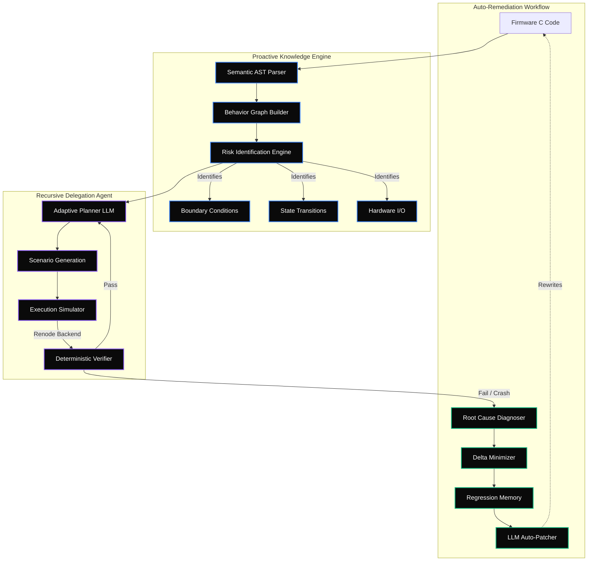

<div align="center">
  
  <h1>PS3 Agent 🛡️</h1>
  <h3>Autonomous Red-Team Agent for Embedded Firmware Security</h3>
  
  <p>
    <b>PS3 Agent</b> is an advanced, LLM-driven autonomous framework designed to systematically hunt for architectural risks, boundary violations, and hardware I/O mismatches in embedded firmware.
  </p>
  
  <p>
    <a href="#overview">Overview</a> •
    <a href="#key-innovations">Key Innovations</a> •
    <a href="#architecture">Architecture</a> •
    <a href="#getting-started">Getting Started</a>
  </p>

  <p>
    
    
    
    
  </p>
</div>

---

## 📖 Overview

Embedded firmware is notoriously difficult to test because its behavior heavily depends on physical hardware states, timing constraints, and unexpected edge-case inputs. Traditional testing requires engineers to manually write test cases, set up hardware-in-the-loop (HIL) systems, and manually investigate failures.

**PS3 Agent** solves this by acting as a proactive, autonomous Red-Team analyst. It dynamically generates Abstract Syntax Trees (AST), constructs a multi-dimensional behavior graph, and orchestrates an intelligent LLM to explore vulnerabilities in simulated environments (like Renode).

> **We don't just generate random tests. The AI dynamically decides what is worth testing next based on real-time execution feedback.**

---

## ⚡ Key Innovations

Inspired by cutting-edge academic frameworks like FirmHive, PS3 Agent introduces several unique capabilities:

- **Recursive Abstract Syntax Tree (AST) Parsing:** Dynamically breaks down C code to isolate bounds, variable states, and hardware I/O control flow.
- **Tree-of-Risk Exploration Engine:** Systematically hunts for Boundary Off-By-Ones, Unsafe State Transitions, and Unhandled Sensor Disconnects.
- **Auto-Patching & Remediation:** The AI doesn't just find the bug; it synthesizes a patch and injects it back into the source codebase automatically.
- **Awwwards-Tier Interactive UX:** Unlike CLI-only academic frameworks, PS3 Agent ships with a gorgeous glassmorphic React dashboard, featuring live behavior graphs and real-time LLM chat capabilities.

---

## 🏗 System Architecture

The agent explores firmware behavior using a highly parallelized, closed-loop architecture.



### The Architectural Golden Rule
> **AI proposes. Tools execute. Deterministic verification decides. Evidence supports every conclusion.**

The LLM is **never** the final authority for PASS/FAIL. Hard mathematical simulation handles the truth, while the LLM acts as the creative navigator.

---

## 🚀 Getting Started

### 1. Installation

```bash
# Clone the repository
git clone https://github.com/17prabhanshu/joyloveswinning.git
cd joyloveswinning

# Install dependencies (Editable Mode)
pip install -e .
```

### 2. Run the Autonomous Dashboard

Ensure you have your API keys exported in your environment:

```bash
export GEMINI_API_KEY="your_api_key_here"

# Start the interactive UI
ps3-agent ui --port 8080
```

*Open `http://localhost:8080` in your browser to access the Red-Team Dashboard.*

---

## 🎯 The Demo Firmware (Fan Controller)

Our included demo targets a mock temperature-controlled fan (`fixtures/firmware/fan_controller.c`) intentionally injected with real-world embedded defects:

1. **Boundary Off-by-One**: `if (temperature > 80)` instead of `>=`.
2. **Missing Sensor Guard**: Disconnected sensor returns `-999`, but the code blindly parses it.
3. **No Range Validation**: Extreme outlier values (`5000°C`) are accepted without clamping.
4. **No Hardware Debounce**: Rapid state toggling induces simulated back-EMF.

The agent will autonomously discover these via simulation, isolate the execution delta, and propose fixes in the web UI.

---

## 💬 The "Grill Me" Chat

Curious why the AI made a specific decision? Switch to the **Deep Dive** tab in the UI. 
You can cross-examine the AI Agent in real-time. It has full context of the memory state, the simulated hardware bounds, and the exact lines of C code that failed.

---

## 📜 Third-Party Attribution & Research Context

This project draws conceptual inspiration from recent academic breakthroughs in autonomous LLM security:
- **FirmHive** (BJTU SecurityLab) — Conceptual inspiration for the Tree-of-Agents and Proactive Knowledge Hub.
- **Renode** (Antmicro) — Deterministic embedded hardware simulation.
- **Fuzzware** — Inspiration for semantic MMIO (Memory-Mapped I/O) exploration.

## 📄 License
This project is licensed under the [Apache 2.0 License](LICENSE).
