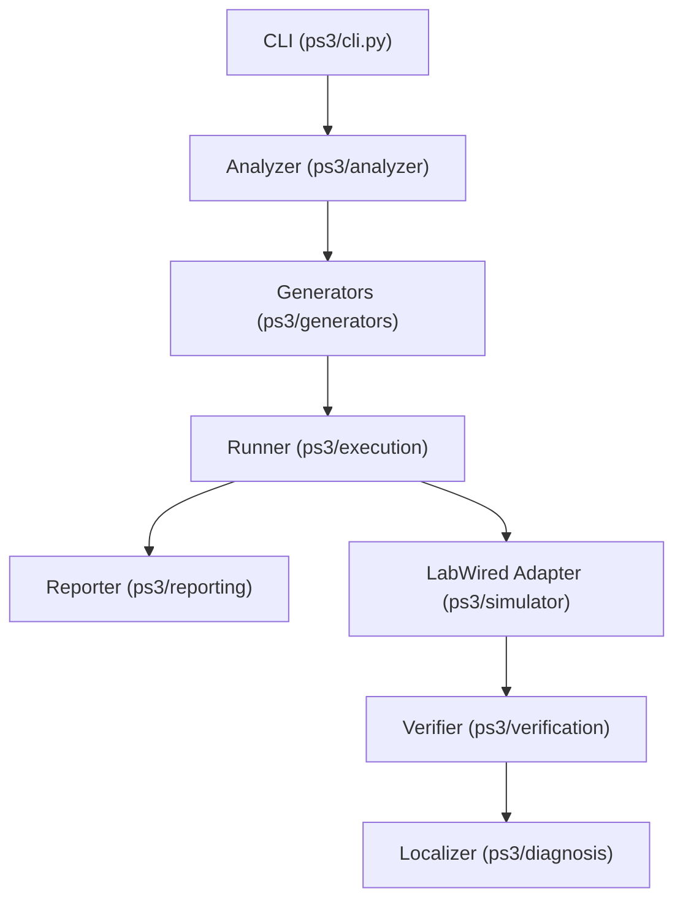

# ARCHITECTURE AUDIT

## 1. System Summary
The PS3 Firmware Agent is a deterministic Python-based CLI application designed to automate the extraction, generation, execution, and verification of embedded firmware tests. It statically analyzes C/C++ firmware using `tree-sitter`, generates Pydantic-modeled boundary and fault scenarios, and orchestrates the external `labwired` CLI via subprocesses to natively execute `.elf` firmware artifacts. The system is structurally designed to eliminate LLM hallucinations by making all PASS/FAIL decisions strictly through deterministic Python verifiers parsing LabWired JSON artifacts.

## 2. Component Diagram

## 3. Phase 2: Dependency and Config Surface

### a) Declared Runtime Versions
- **Python:** `>=3.9` (`pyproject.toml:11`)

### b) Third-Party Services
- **LabWired Core CLI:** Invoked as a local binary via `subprocess.run` (`ps3/simulator/labwired.py:126`).
- *(Optional)* **OpenAI / Gemini / Anthropic:** Declared in `pyproject.toml:24` but NO client construction exists in the codebase.
- *(Optional)* **Z3 Solver:** Declared in `pyproject.toml:25`, conditionally imported in `ps3/generators/z3_gen.py:8`.

### c) Configuration Values
The system does not read any OS environment variables (`os.environ` or `os.getenv`).
All configuration is passed explicitly through CLI arguments defined in `ps3/cli.py` (e.g., `--chip`, `--system`, `--max-iterations`).

**VERIFICATION:**
- **Zero Import Sites:** `tree-sitter-cpp` is declared in `pyproject.toml:20` but never imported anywhere in the `ps3/` codebase.

## 4. Phase 3: Entry Points and Control Flow

| Type | Path / Command | Handler Function | Auth | File:Line |
|------|----------------|------------------|------|-----------|
| CLI  | `analyze`      | `analyze`        | None | `ps3/cli.py:14` |
| CLI  | `plan`         | `plan`           | None | `ps3/cli.py:21` |
| CLI  | `test`         | `test`           | None | `ps3/cli.py:28` |
| CLI  | `report`       | `report`         | None | `ps3/cli.py:63` |
| CLI  | `demo`         | `demo`           | None | `ps3/cli.py:70` |

**VERIFICATION:**
- No HTTP routes, API call sites, scheduled jobs, or event consumers exist.

## 5. Phase 4: Data Model and Persistence

### Persistence Layers
1. **Regression Corpus (JSON files):**
   - **Entity:** `TestScenario`, `VerificationResult`, `DiagnosisResult`.
   - **Written:** `ps3/regression/manager.py:25`
   - **Read:** `ps3/regression/manager.py:33`
2. **HTML / JSON Reports:**
   - **Written:** `ps3/reporting/report.py:31` (JSON) and `ps3/reporting/report.py:46` (HTML)

### Lifecycle of Core Domain Object: `TestScenario`
1. **Creation:** Generated as a Pydantic model by `BoundaryTestGenerator` (`ps3/generators/boundary.py:14`).
2. **Execution:** Consumed by `TestRunner.run_test` (`ps3/execution/runner.py:45`), which builds LabWired YAML assertions from its `expected_outputs`.
3. **Verification:** Validated by `Verifier.verify` (`ps3/verification/verifier.py:92`).
4. **Persistence:** Written to a JSON file by `RegressionManager.save_regression` (`ps3/regression/manager.py:18`).

**VERIFICATION:**
- No ORMs, raw SQL, or schemas exist in the repository.

## 6. Phase 5: Boundaries, Trust, and Failure

### a) Trust Boundaries
- **CLI Arguments:** The `firmware_dir` argument in `ps3/cli.py` is directly resolved as a `Path` and passed into the `LabWiredAdapter` (`ps3/simulator/labwired.py:96`), which is subsequently passed into `subprocess.run`.

### b) Secrets and Credentials
- None exist.

### c) Error Handling and Retry
- **Subprocess Failures:** `LabWiredAdapter.execute` (`ps3/simulator/labwired.py:133`) catches `subprocess.TimeoutExpired` and translates it into a deterministic `SimulationResult` object with `status="error"`.
- **Top-Level Catch:** The CLI commands catch broad `Exception` objects (`ps3/cli.py:60`, `ps3/cli.py:100`) and print them to the console.

### d) Expensive / Unbounded Operations
- **Process Timeout:** LabWired subprocess execution is bounded by a fallback timeout of 60 seconds (`ps3/simulator/labwired.py:130`).
- **Iteration Limits:** The autonomous loop is strictly bounded by `max_iterations` (`ps3/agent/loop.py:38`), defaulting to 5 iterations.

---

## 7. INFERRED (unverified)
- I infer that `LabWiredAdapter_Mock` (referenced in `ps3/cli.py:40` but not implemented) was intended for unit testing but bypassed during the demo script development.

## 8. OPEN QUESTIONS
1. **Unused Dependencies:** `tree-sitter-cpp` is in `pyproject.toml` but unused. Should I remove it from the dependencies list? *(Matters because it reduces build size/complexity)*
2. **LLM Implementation:** `openai` and `google-generativeai` are defined as optional dependencies. Are we planning to integrate an LLM client into the `AutonomousAgent` loop, or should the testing remain strictly deterministic? *(Matters for scoping the AI component of the hackathon).*

## 9. DEAD OR ORPHANED
- **Dependency:** `tree-sitter-cpp` is orphaned.
- **Reference:** `LabWiredAdapter_Mock` is referenced in `ps3/cli.py:40` but the class does not exist.
